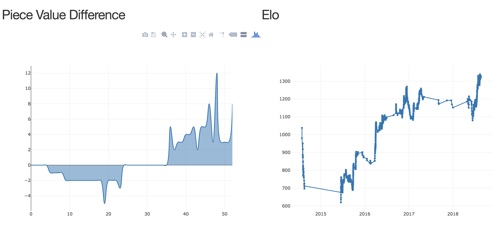
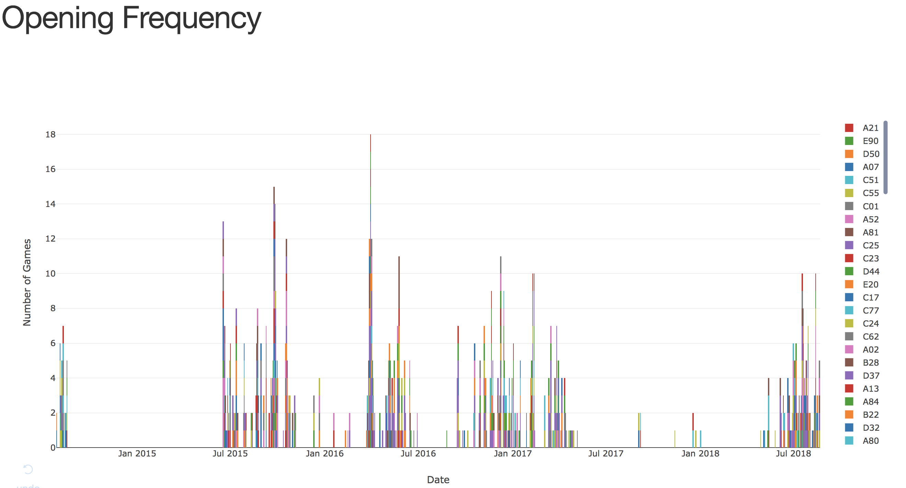
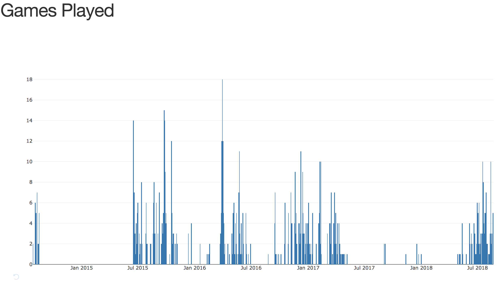
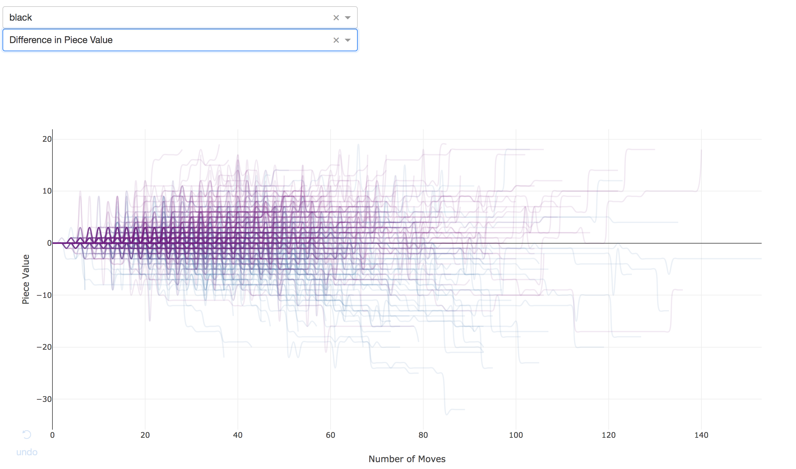

# ChessVision
Interactively visualize your chess history from Chess.com

This app gives you a way to visually understand the history of your chess games from Chess.com. 
It includes graphs of:
* Elo over time
* Piece value difference over the course of individual games
* Frequency of openings used by day
* Visualization of all your games through piece count









To run locally on your own browser:

* Clone this repo and cd into the chessvision directory

* Create a virtual env and activate it
```bash
virtualenv venv
source venv/bin/activate
```
* Pip install from the requirements.txt
```bash
pip install -r requirements.txt
```

* Run **python src/app.py** to start the app
```bash
python src/app.py
```

* Finally, paste the address given of your local host into your address bar or command + click on the address in terminal

Here is quick visual overview of how to use chessvision:

<p align="center">
  
</p>
